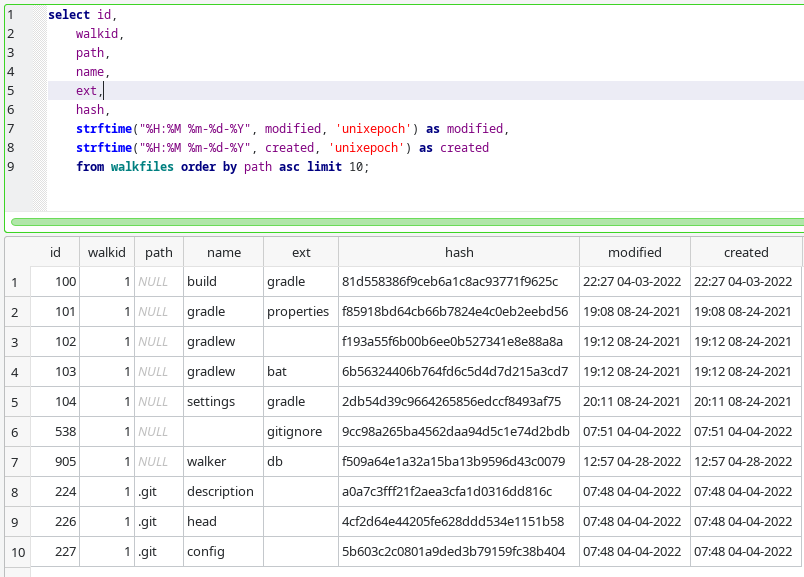

# Walker
Simple tool that traverses a directory and puts file names, extensions, creation and modification dates into an sqlite database, written in Kotlin.

Useful when the search ability of your standard file explorer is not enough.

Here is an example of what you will get:

